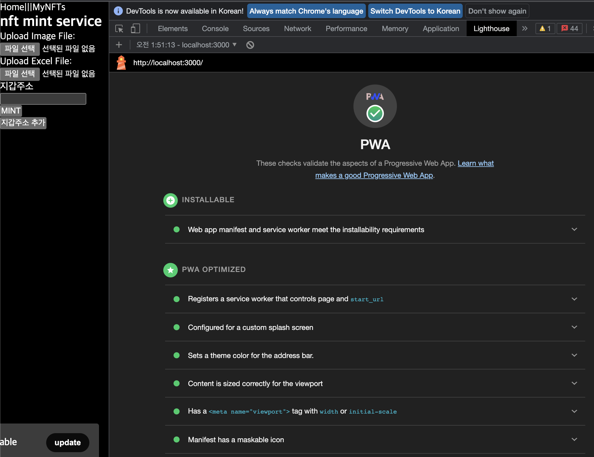

## PWA : nextjs-pwa-example 를 참고해 제작
Thanks for [nextjs-pwa-example](https://github.com/vercel/next.js/tree/canary/examples/progressive-web-app)

## DEMO

## TODO
[ ] PWA 추가 - 버튼 클릭시 알람 (nft 발급에 대한 알람은 web socket 이용하게 되려나?)   
[ ] PWA 추가 - 버튼 클릭시 메타마스크 팝업 (메타마스크를 통해 접속하지 않고도 모바일 기기에 설치된 메타마스크를 띄울 수 있는지)   
[ ] 블록체인 검증 환경 구성 - 폴리곤 테스트넷 연결   
[ ] 블록체인 상용 환경 구성 - 폴리곤 메인넷 연결   
[ ] IPFS 검증/상용 환경 구성 - pinata 연결   

## 로컬 실행 방법
1. IPFS Desktop 을 실행
2. Ganache-cli 로 가나쉬 이더리움 블록체인 넷 실행
3. 새로 생성 된 지갑주소 중 0 번째 지갑주소/개인키를 truffle-config.js 에 복사
4. Truffle migrate 명령어로 가나쉬에 스마트 컨트랙트 배포
5. 배포 된 컨트랙트 주소를 next.config.js에 복사 및 스마트 컨트랙트 인터페이스 컴파일 결과물인 abi 파일(TextNFT.json) 을 /src/TestNFT.json 에 복사
6. ngrok http 3000 로 포트포워딩을 해 준다 (+ https 서빙)